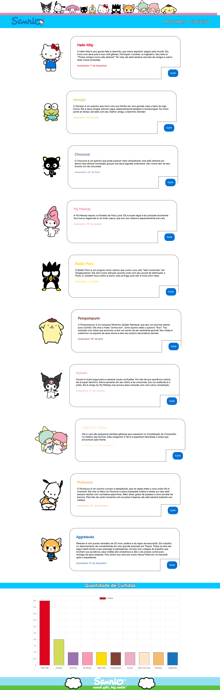

# Sanrio

Projeto Pessoal de site com os personagens da Sanrio com gráfico dinâmico de curtidas, com o objetivo de praticar CRUD em node.js. Recursos utilizados: HTML, CSS, JavaScript, Node e Mysql.

Resultado final:

© Todos os direitos reservados

